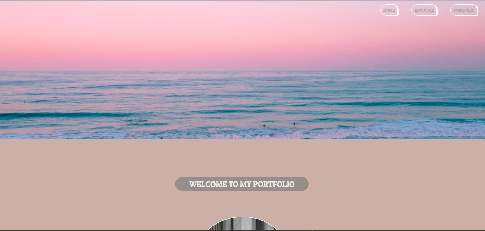
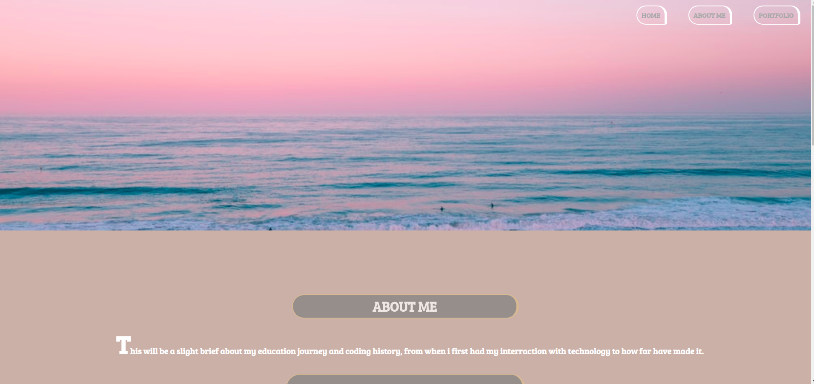
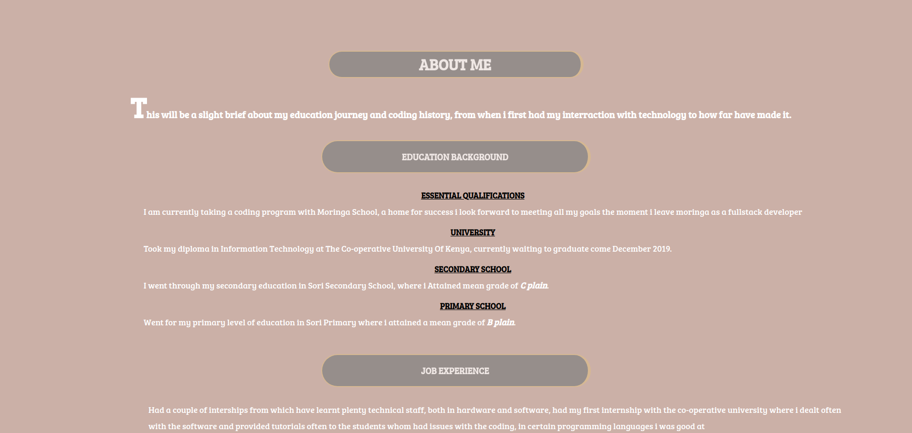
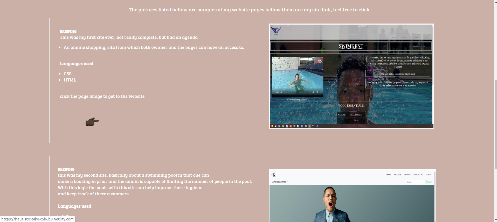
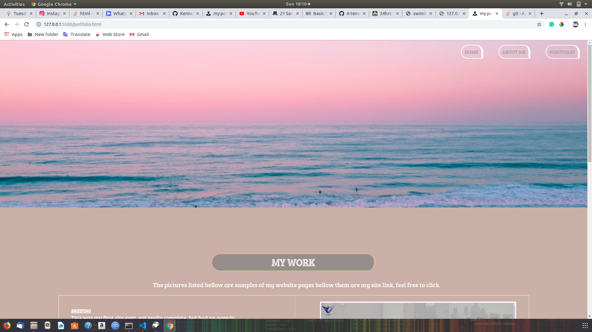

# MY PORTFOLIO

## Project Author
> **NAME :** Kenneth Ochieng Joseph

## Screenshots
> **Visual presentation of my work**
 >>##### homepage

 >> ##### about me page 
 

 

 >> ##### my work page
 
 
 >> ##### contact me
 

 ## Description
 This project is entirely about my *portfolio* through this those who wants to know more about the jobs have done before uses it 
   >>> ##### Who it serves
 Apparrently my project is directed to my clients whom wants to know more about me, interms of my work .
 
 ## Access the site
  To access the site click on this link
  click [myportfolio](https://kenneth-joseph.github.io/portfolio/)

 ## Project setup
 As a developer will make it real esier for you to use this site.. , by using this link :
  >> https://github.com/Kenneth-joseph/portfolio.git
you can make *a clone*, the code and try and run them on your own making all the edition you need, without intefering with the main project
below are the steps involved:
  *Open Terminal.

  * Change the current working directory to the location where you want the cloned directory to be made.

  * Type git clone, and then paste the URL given up there as a link.

  * $ git clone https://github.com/YOUR-USERNAME/YOUR-REPOSITORY

  * Press Enter. Your local clone will be created.